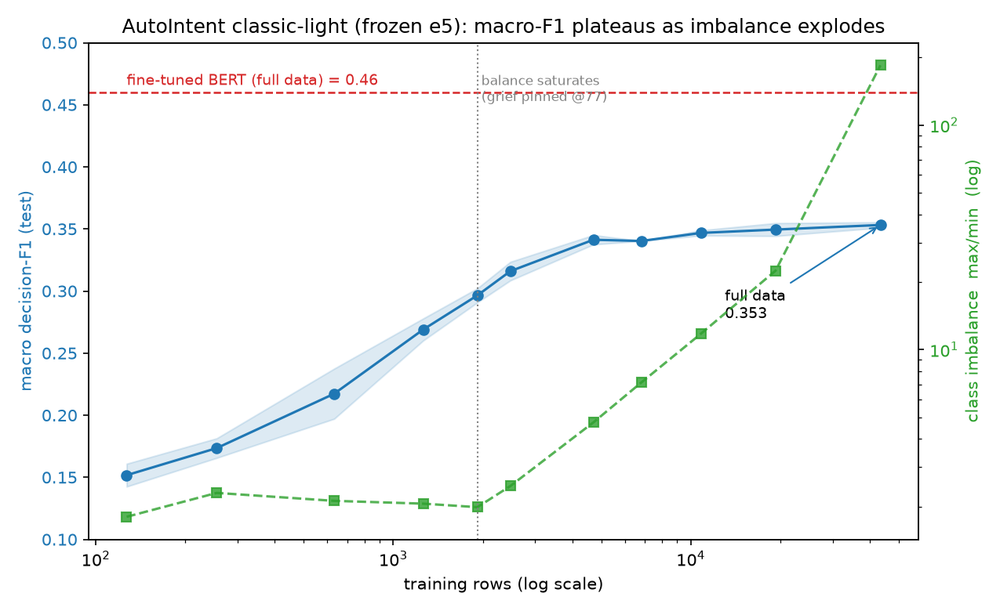
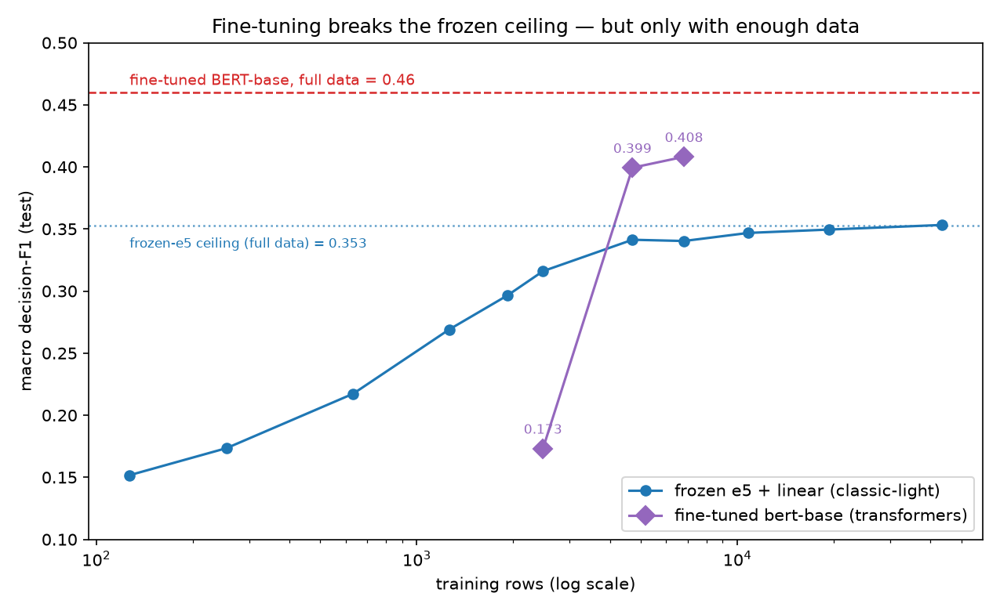

# AutoIntent Multilabel Capability — Results Report (GoEmotions)

**Run:** autonomous overnight, 2026-06-16, 00:45–03:15. **Phase 3 extension:** 2026-06-19, 00:10–01:30
(AutoIntent 0.3.1; see §9).
**Setup:** AutoIntent 0.3.0 (Phase 1/2) / 0.3.1 (Phase 3, version-controlled — §9), preset `classic-light`,
embedder `intfloat/multilingual-e5-large-instruct`,
device `mps`. GoEmotions `simplified`, 28 classes, genuinely-but-sparsely multilabel (mean 1.17
labels/example). Two-phase design per `DESIGN.md`: Phase 1 picks `(scoring, decision)` target metrics on
the `validation` split; Phase 2 reports the capability curve on the disjoint `test` split. Headline metric:
**macro `decision_f1`** (every class weighted equally, so the rare tail dominates — the multilabel ability
we want to probe). `decision_accuracy` ignored (≈0.92 all-negative baseline).

---

## 1. Capability verdict (TL;DR)

- **AutoIntent's `classic-light` AutoML does learn this 28-class sparse-multilabel task.** Macro-F1 rises
  monotonically with per-class budget, from **0.152 (5-shot) to 0.316 (100-shot)** on the held-out test
  split, and is **still climbing at 100-shot** (no plateau) — per-class data is the binding constraint.
- **Balanced per-class data is far more sample-efficient than raw volume.** At a matched ~2.7k training
  rows, balanced data scores **0.316** vs imbalanced **0.248** (+0.068 macro-F1). Imbalanced data needs
  **14.1k** rows to reach just 0.281 — still below what balanced data achieves with 2.5k.
- **AutoIntent adapts its pipeline to the regime.** It selects `mlknn` at tiny N, switches to `linear`
  (logreg on e5 embeddings) for balanced moderate N, and `knn` for imbalanced data — and the *optimal
  target metric differs by balance* (see §4), vindicating the design's per-balance selection.
- **The optimizer over-predicts** (recall > precision throughout) — it favors coverage of the rare tail
  at the cost of precision, which is the right bias for macro-F1 on a long tail.
- **(Phase 3, §9) The frozen-embedding ceiling is ~0.35, and it is not a data problem.** Extending the
  classwise cap to the full 43,410 rows lifts macro-F1 only to **0.353** — an **18× data increase past
  cap-100 buys just +0.04**, and the last 38k rows are nearly wasted. The ~0.11 gap to fine-tuned BERT
  (0.46) is therefore **not** data starvation but the frozen, task-agnostic representation plus tail
  imbalance — so **transformer fine-tuning is genuinely required** to go materially above ~0.35 here.
  This *falsifies* §5's earlier "full data likely reaches 0.38–0.43 (data is the main cause)" prediction.
- **(Phase 4, §10) Fine-tuning breaks the ceiling — but needs data, and the preset needs fixing.** Fine-tuning
  bert-base end-to-end (AutoIntent `transformers` preset, on MPS) reaches macro-F1 **0.407 at cap-300**, above
  frozen-e5's full-data 0.353 and nearing fine-tuned BERT's 0.46 — confirming FT is the lever. But the
  crossover is sharp: at cap-100 FT is only **0.173** (worse than frozen's 0.316), so below ~2.5k rows frozen
  e5 + linear wins. The stock preset recipe *collapses* on this sparse multilabel (lr too high + a broken
  `scoring_f1`@0.5 early-stop); it needed lr 2e-5 + early-stopping disabled to learn.

---

## 2. Primary result — classwise capability curve (balanced, eval=test)

Frozen target metrics: **`scoring_neg_coverage` + `decision_f1`**. `classwise-N` = ≤N samples/class.

| shots | train rows | seeds | **macro-F1** | ±std | precision | recall | selected scorer/decider |
|------:|-----------:|:-----:|:------------:|:----:|:---------:|:------:|:------------------------|
| 5   | 127  | 5 | **0.152** | 0.009 | 0.121 | 0.326 | mlknn / adaptive |
| 10  | 255  | 5 | **0.174** | 0.008 | 0.163 | 0.275 | mlknn / adaptive |
| 25  | 633  | 3 | **0.217** | 0.020 | 0.205 | 0.389 | linear / adaptive |
| 50  | 1261 | 3 | **0.269** | 0.009 | 0.223 | 0.509 | linear / adaptive |
| 100 | 2475 | 3 | **0.316** | 0.008 | 0.263 | 0.477 | linear / adaptive |

- **Monotonic, low variance.** Tight std (≤0.02) even at 5/10-shot. `classwise-5` did **not** fail (the
  design's feared "rare class absent from carved HPO-val" did not materialize for these seeds).
- **Module crossover at N≥25:** `mlknn` (a multilabel-native KNN) wins when data is scarce; `linear`
  (one-vs-rest logreg on e5 embeddings) takes over once there are ~25+/class. A real capability signal:
  with enough balanced data, a simple linear head on strong embeddings is AutoIntent's best choice here.
- Absolute numbers look low because the metric is **macro** on a 28-class long tail (test's rarest class
  has only 6 examples); this is intentional, not underperformance.

## 3. Realism anchor — stratified curve (imbalanced, eval=test)

Frozen target metrics: **`scoring_precision` + `decision_f1`**. `stratified-N` = natural proportions with a
floor of N/class (so total size grows with N). Capped at floor-25 (~14k) to protect the machine.

| floor | train rows | seeds | **macro-F1** | ±std | precision | recall | selected scorer/decider |
|------:|-----------:|:-----:|:------------:|:----:|:---------:|:------:|:------------------------|
| 5  | 2,819  | 5 | **0.248** | 0.013 | 0.228 | 0.307 | mlknn / adaptive |
| 10 | 5,658  | 5 | **0.263** | 0.015 | 0.252 | 0.314 | mlknn / threshold |
| 25 | 14,121 | 3 | **0.281** | 0.008 | knn / threshold | | |

(precision≈recall here, unlike classwise's recall-heavy predictions.)

### The balance comparison — done honestly (size-controlled)

**Naïve, shots-matched comparison is misleading** and must not be used: `stratified-5` (0.248) appears to
beat `classwise-5` (0.152), but only because `stratified-5` carries **2,819** training rows vs
`classwise-5`'s **127** (a 22× data advantage). This is the exact size≠balance confound `DESIGN §8` warns
about.

**Size-matched comparison (the valid one):** at ~2.7k training rows,
- balanced `classwise-100` (2,475 rows) = **0.316**
- imbalanced `stratified-5` (2,819 rows) = **0.248**

→ **balancing the per-class budget is worth ~+0.07 macro-F1 at fixed data volume**, and imbalanced data is
dramatically less efficient (14.1k imbalanced rows reach only 0.281). Because macro-F1 weights the rarest
classes equally, guaranteeing each class a budget is what drives the gap. This is a *directional* result
(the two regimes still differ in composition, not just balance), but the direction is unambiguous.

## 4. Target-metric selection (Phase 1, eval=validation)

Per-balance selection over the 9 scoring × 3 decision grid (`decision_accuracy` dropped as degenerate),
2 seeds. **The winners differ by balance — the design's per-balance selection was the right call:**

| balance | frozen scoring | frozen decision | winning scorer | notes |
|---|---|---|---|---|
| classwise  | `scoring_neg_coverage` | `decision_f1` | linear | ties `neg_ranking_loss` exactly; clear winner |
| stratified | `scoring_precision`    | `decision_f1` | mlknn/knn | top-4 within 1 std → **within-noise** |

- **The decision target barely matters.** In both balances, `decision_f1/precision/recall` produced near-
  identical results for a given scorer (the deciders self-tune thresholds). The **scoring** metric and the
  **scorer module** are what move the needle.
- `decision_f1` was chosen as the freeze in both (aligned with the headline metric; it tied or led).

---

## 5. How these results compare to the GoEmotions literature

Our headline (macro `decision_f1`) is directly comparable to the published GoEmotions macro-F1: **same
28-class taxonomy, same held-out `test` split**. The difference is purely on the *training* side — published
baselines **fully fine-tune a transformer on all ~43,410 training rows**, whereas AutoIntent here uses a
**frozen e5 embedder + a shallow linear/KNN head on ≤2,475 balanced rows (~6% of the data)**.

| Approach | Train | Fine-tuned | macro-F1 | micro-F1 |
|---|---|:--:|:--:|:--:|
| BiLSTM — original baseline [1] | full ~43k | — | 0.41 | — |
| **BERT-base — original baseline [1]** | full ~43k | full | **0.46** | 0.51 |
| RoBERTa + psycholinguistic features (as reported) [3,4] | full | full | ~0.59 | — |
| PK-GAT (recent, as reported) [4] | full | full | 0.587 | 0.699 |
| **AutoIntent `classic-light` (Phase 2, ~6% data)** | **~2.5k balanced** | none (frozen e5) | **0.316** | n/a |
| **AutoIntent `classic-light` — FULL data (Phase 3, §9)** | **full ~43k** | none (frozen e5) | **0.353** | n/a |
| **AutoIntent `transformers` — FT bert-base @cap-300 (Phase 4, §10)** | **~6.8k balanced** | full (bert-base) | **0.407** | n/a |

(A "RoBERTa 0.85 macro-F1" figure circulates online but is **not** a credible 28-class macro number — likely
accuracy or a coarse sentiment grouping. The real 28-class macro range is ~0.41–0.59.)

**Verdict — good for what it is, not vs the leaderboard.** As an absolute number, 0.316 is ~0.15 below
fine-tuned BERT and ~0.27 below SOTA. But it reaches **~69% of fine-tuned BERT's macro-F1 with ~6% of the
data and zero fine-tuning**, and the curve had not plateaued at 100-shot — good sample efficiency from a
no-GPU AutoML pipeline. AutoIntent is not built to win this leaderboard; it is built to produce a sensible
classifier cheaply, which it does.

**Do you need transformer fine-tuning?** To *maximize* macro-F1, yes — every number above 0.46 comes from a
fine-tuned transformer, because fine-grained emotion is subtle and a frozen *retrieval* embedder (e5, tuned
for semantic similarity) does not emphasize the emotion-discriminative features a shallow head could exploit.
**However, this run cannot yet prove FT is *necessary*:** it conflates two effects (below) because we capped
training at ~2.5k and never measured AutoIntent's frozen-embedding ceiling on the full data.

**Where the 0.316 → 0.46 gap comes from (decomposed):**
1. **Data starvation (largest, most certain).** ~6% of the training data; the curve is still rising.
2. **Frozen, task-agnostic embeddings.** No task adaptation of the representation — the structural ceiling.
3. **Macro-F1 on a brutal tail.** Rare classes (`grief` ~77 even in full data) score ~0 even for SOTA; our
   test tail's rarest class has 6 examples → high-variance, drags the macro average down.
4. **Multilabel thresholding.** Low precision (0.12–0.26) with higher recall → over-prediction across 28
   classes; fine-tuned models with learned per-class thresholds handle this better.
5. **Preset capacity.** `classic-light` is KNN/linear/mlknn only; `classic-medium/heavy` or an FT preset
   has more headroom.

Causes (1) and (2) dominate and are entangled; the runs in §8 are designed to separate them. Rough
prediction: full-data frozen e5 + linear likely reaches ~**0.38–0.43** (closing most of the gap to BERT but
stalling short), leaving the final ~0.05–0.15 up to SOTA as the part that genuinely needs fine-tuning.

> **Update (Phase 3, §9): this prediction was tested and falsified.** Running `classic-light` on the full
> 43,410 rows reaches only **0.353 ± 0.002 (3 seeds)** — an 18× data increase over cap-100 buys +0.04. Cause (1) data
> starvation is therefore **not** the dominant gap; cause (2) the frozen representation (plus the tail
> imbalance of cause 3) is the wall. Fine-tuning is needed to exceed ~0.35. See §9.

## 6. Threats to validity & honest caveats

1. **Stratified is truncated at floor-25 (14k rows).** Floors 50 (28k) and 100 (full 43k) were excluded:
   a single 28k-row fit ran >17 min and risked the 17 GB machine. So there is **no "stratified full-data"
   point**; the stratified curve stops at 14k. The classwise (primary) claim is unaffected.
2. **Cross-balance is directional only.** The size-matched comparison in §3 is the valid one; the
   shots-matched view is a data-volume artifact and is explicitly *not* used for conclusions.
3. **Stratified metric selection is within-noise** (top-4 scoring pairs within one std at 2 seeds). The
   frozen stratified pair should be read as "a reasonable choice," not "the proven best."
4. **Phase-1 economy:** 2 seeds; classwise metric frozen from sizes {25,50}, stratified from floor-5 only
   (no cross-size stability sweep for stratified). Applied across the whole ladder.
5. **Thin test tail:** test's rarest class has 6 examples, so the macro-F1 tail contribution is
   high-variance; seeds average *model* noise but cannot add eval examples.
6. **Sparse multilabel:** mean 1.17 labels/example — the genuinely-multilabel signal is a minority slice.
7. **Single embedder/preset (`classic-light` + e5-large, mps).** Not a statement about transformer-FT
   presets or other embedders.
8. **Selection vs reporting are disjoint splits** (validation → test), so headline numbers are not
   selected-on — the one good-news caveat. Per-run HPO (module + thresholds) is tuned only on the
   HPO-validation AutoIntent carves from train.

## 7. Operational finding (worth fixing upstream)

**AutoIntent 0.3.0 calls `huggingface_hub.model_info()` on every `embed()`** (to key its embeddings cache
by the model's remote commit hash, `_wrappers/embedder/sentence_transformers.py:61`). Under a fast sweep
this floods HF's **1000-requests/5-min** quota → HTTP 429 (compounded here by other worktree agents sharing
the IP), and it is **fatal under `HF_HUB_OFFLINE`**. It silently failed 14 Phase-2 cells before diagnosis.
**Fix applied locally** in `src/pipeline.py::_patch_embedder_offline_cache_key`: resolve the commit hash
from the cached `refs/main` (identical to the remote sha, so the cache key is unchanged) and fall back to
the model name — no network. All sweeps then ran with `HF_HUB_OFFLINE=1`. Recommend upstreaming a local-
first hash resolver to AutoIntent.

**0.3.1 update (Phase 3):** the call site changed to `_get_latest_commit_hash(model_name, revision)` (two
positional args), so the monkeypatch's one-arg replacement would have raised `TypeError` on every fit. Fixed
by adding the optional `revision` param to the patched function. The bug still stands in 0.3.1 — the
local-first resolver remains worth upstreaming.

**Transformers preset (Phase 4) — three operational gaps on sparse multilabel:**
1. **Missing dependency.** The `transformers` preset's `bert` scorer needs `accelerate>=0.26` (HF Trainer),
   which the `sentence-transformers` extra does not install → every fit dies with `ImportError` until
   `accelerate` is added. Worth adding to the preset's extras.
2. **Broken early-stopping default for sparse multilabel.** The bert scorer early-stops on `scoring_f1`@0.5,
   but calibrated sparse-multilabel probabilities sit below 0.5, so the metric is ≈0 from step 1 → it stops
   immediately and `load_best_model_at_end` restores a near-random model (degenerate all-positive output).
   A threshold-free early-stop metric (loss, or a ranking metric like neg_coverage) would be far more robust.
3. **LR is knife-edged and uncached across HPO.** lr 3e-5 (a preset value) collapses on this task; only
   2e-5 learned. And with early stopping off, the transformers HPO retrains the transformer per scoring
   trial — fine for `transformers-no-hpo` (one config) but expensive for `transformers-light`'s 40-trial grid.

## 8. Suggested next runs (not done tonight)

To close the leaderboard gap and answer "is fine-tuning needed" (§5), in priority order:

- ~~**`classic-light` on the FULL 43k train (frozen, no subsample)**~~ — **DONE in Phase 3 (§9).** Result:
  **0.353 ± 0.002 (3 seeds)**, i.e. the "plateaus ~0.33–0.37 → frozen-embedding wall, FT genuinely required"
  branch. The 43k fit ran ~16 min/seed on the 17 GB MPS machine (memory stayed >70% free; no GPU needed).
- **An AutoIntent fine-tuning preset** (cross-encoder / fine-tuned scoring node, if available) on full data —
  directly quantifies the FT lift over frozen embeddings.
- Complete the stratified curve at floors 50/100 (full data) on the same bigger box, for a true
  balance-vs-volume crossover.
- Re-confirm the stratified frozen pair with more seeds / a cross-size stability check (it's within-noise).
- A size-matched `natural` ablation (same total size as classwise-N, natural proportions) for a clean
  balance-only contrast at several points, not just the single ~2.7k overlap.

## 9. Phase 3 — Full-data extension: the frozen-embedding ceiling (2026-06-19, AutoIntent 0.3.1)

**Question (user):** raise the classwise cap until the data saturates *or* becomes too imbalanced — where
does macro-F1 plateau, and does the full-data point (apples-to-apples vs fine-tuned BERT) close the gap?

**Version control.** Phase 3 ran on AutoIntent 0.3.1; Phase 1/2 used 0.3.0. A control re-fit of
`classwise-100`/seed-1 on 0.3.1 reproduced the 0.3.0 result **bit-for-bit** (`decision_f1 =
0.32409774762737037`, identical precision/recall and modules), so the two phases form **one consistent
curve**. (The offline embedder patch also needed a one-line fix for 0.3.1's changed call signature — §7.)

**Why the classwise cap is the right knob.** `classwise_subsample` keeps a row while *any* of its labels is
still below the cap, so the *balanced* property is hard-bounded by the rarest class (`grief`, 77 train
rows). Past cap 77, `grief` is pinned and every extra row only buys imbalance. So "saturate the data" and
"make it imbalanced" are **not two endpoints**: balance saturates at cap 77, *data* saturates only at the
full 43,410 rows, and imbalance grows continuously between. **Cap 50000 ≡ no cap** (every class total <
50000) = the full natural distribution — the same training set the BERT baseline fine-tunes on.

### The full curve (balanced → natural), eval=test, frozen pair `scoring_neg_coverage + decision_f1`

*macro-F1 (blue, left) plateaus at ~0.35 — far below fine-tuned BERT's 0.46 (red) — exactly as class
imbalance (green, right, log) explodes past the cap-77 balance-saturation line. Rendered by `plot_curve.py`.*

| cap | train rows | seeds | **macro-F1** | ±std | prec | recall | max/min | CV | #pinned | scorer/dec |
|----:|-----------:|:----:|:------------:|:----:|:----:|:------:|:-------:|:---:|:-------:|:-----------|
| 5    | 127    | 5 | 0.152 | 0.009 | 0.121 | 0.326 | 1.8   | 0.22 | 0  | mlknn/adaptive  |
| 10   | 255    | 5 | 0.174 | 0.008 | 0.163 | 0.275 | 2.3   | 0.24 | 0  | mlknn/adaptive  |
| 25   | 633    | 3 | 0.217 | 0.020 | 0.205 | 0.389 | 2.1   | 0.21 | 0  | linear/adaptive |
| 50   | 1,261  | 3 | 0.269 | 0.009 | 0.223 | 0.509 | 2.1   | 0.20 | 0  | linear/adaptive |
| 77   | 1,918  | 3 | 0.296 | 0.006 | 0.248 | 0.475 | 2.0   | 0.19 | 0  | linear/adaptive |
| 100  | 2,475  | 3 | 0.316 | 0.008 | 0.263 | 0.477 | 2.5   | 0.19 | 1  | linear/adaptive |
| 200  | 4,708  | 3 | 0.341 | 0.004 | 0.294 | 0.454 | 4.7   | 0.24 | 4  | linear/adaptive |
| 500  | 10,820 | 2 | 0.347 | 0.002 | 0.313 | 0.444 | 11.8  | 0.37 | 5  | linear/adaptive |
| 1000 | 19,286 | 2 | 0.350 | 0.005 | 0.312 | 0.450 | 22.5  | 0.46 | 10 | linear/adaptive |
| **full** | **43,410** | **3** | **0.353** | **0.002** | **0.344** | **0.394** | 184.7 | 1.41 | 28 | linear/adaptive |

Imbalance columns (`max/min` = most-populated ÷ least-populated class; `CV` = std/mean of per-class counts;
`#pinned` = classes that never reach the cap) computed from the saved datasets by `analyze_imbalance.py`
(seed 1). caps {5,10,25,50,100} are the Phase-1/2 banked points (0.3.0); caps {77,200,500,1000,full} are
new Phase-3 fits (0.3.1) — version-equivalent per the control above.

### Findings

1. **The curve plateaus hard around 0.35.** From cap-100 (0.316) to full data (0.353 ± 0.002) — an **18×
   increase in training rows** — macro-F1 gains only **+0.037**. From cap-1000 (19k) to full (43k):
   **+0.004**. Adding data past ~5k rows (cap 200) is nearly free of benefit, and the full-data ±0.002 over
   3 seeds confirms the plateau is real, not single-run noise.

2. **A falsified prediction makes the verdict cleaner.** §5 predicted full-data frozen-e5 + linear would
   reach **~0.38–0.43** ("data starvation is the largest, most certain cause"). It does **not** — it stalls
   at **0.353**. This *disentangles* §5's two confounded causes: the gap to fine-tuned BERT (0.46) is **not**
   data volume (18× more data is almost flat). The binding constraint is the **frozen, task-agnostic e5
   representation** (plus tail/imbalance handling). So for this task **transformer fine-tuning is genuinely
   required** to exceed ~0.35 — the "frozen-embedding wall" branch, not the "mostly data" branch.

3. **Imbalance, not data exhaustion, ends the curve.** As the cap rises the regime crosses from balanced
   (max/min ≈ 2 through cap 77, CV ≈ 0.2) to extreme (max/min = **185** at full data, CV **1.41**, all 28
   classes pinned). The plateau coincides exactly with imbalance taking over: extra rows pile onto majority
   classes (`neutral` 14,219) while the rare tail stays pinned at its natural floor (`grief` 77), and macro-F1
   weights them equally.

4. **Precision and recall cross over as imbalance grows.** Recall falls monotonically from 0.509 (cap 50) to
   its curve-low **0.394** at full data, while precision rises from 0.223 to its curve-high **0.344**. The
   optimizer shifts from over-predicting the tail (high recall, the small-N bias noted in §1) to conservative
   majority-fitting (high precision); imbalance starves rare-class recall and macro-F1 stays flat only because
   precision gains offset it. Learned per-class thresholds / class weighting (which fine-tuning provides) are
   what break this trade-off.

5. **AutoIntent's module choice is stable at scale.** `linear` (one-vs-rest logreg on frozen e5) + `adaptive`
   decider win at **every** cap ≥ 25, including full data. The ~0.35 ceiling is a property of the frozen
   representation, not of an unlucky module pick at one size.

### Updated capability verdict (supersedes §5's "where the gap comes from")

AutoIntent `classic-light` (frozen e5-large + shallow head) tops out at **macro-F1 ≈ 0.35** on GoEmotions —
**~77% of fine-tuned BERT (0.46) with zero fine-tuning** — but it reaches that ceiling by ~cap-200 (≈5k
rows) and the remaining ~38k training rows are nearly wasted. The ~0.11 residual to BERT is now attributable
to **representation + imbalance handling, not data volume**. **To go above ~0.35 you need transformer
fine-tuning** (an AutoIntent FT / cross-encoder preset, or a fine-tuned scoring node) that adapts the
representation to emotion-discriminative features and learns the per-class thresholds the long tail needs.

### Caveats specific to Phase 3
- **Full-data ±std is optimizer-only.** cap-50000 keeps every row, so all seeds share an identical training
  set; seeds 2–3 vary only AutoIntent's HPO seed (carved val + optuna), so the full-data std measures
  optimizer noise, not data-subsampling noise (unlike lower caps).
- **Frozen pair was selected at small balanced N** (Phase 1) and applied unchanged at full natural data — a
  mild extrapolation, mitigated by `linear/adaptive` winning at every cap ≥ 25.
- **"Ceiling" is specific to `classic-light` + e5-large.** A different embedder or a heavier frozen preset
  could shift the absolute number; the robust claim is **"more *data* is not the lever,"** not "no frozen
  setup beats 0.35."

---

## 10. Phase 4 — Fine-tuning the transformer: breaking the frozen ceiling (but only with enough data) (2026-06-19)

**Question (user):** Phase 3 *inferred* fine-tuning is needed to beat the ~0.35 frozen ceiling. Phase 4
tests it directly: use AutoIntent's `transformers` preset to fine-tune a transformer end-to-end at the
balanced caps 100 and 300, on this MPS machine.

**Setup.** `transformers-no-hpo` preset → `bert` scoring node (HF Trainer, `multi_label_classification`,
BCE, sigmoid). Model = **bert-base-uncased** — cached (runs offline) and the exact model of the published
GoEmotions baseline (0.46), so FT-vs-baseline is apples-to-apples. Device mps. Decision target =
`decision_f1` + `adaptive` decider (same as the Phase-3 frozen curve ⇒ matched comparison). Runner:
`run_finetune.py`. **Cost:** the single fixed scoring config trains the transformer once per cap (n_trials
only tune the decision threshold); ~11 min (cap-100) to ~31 min (cap-300) on MPS. Needed `uv add accelerate`
(HF Trainer dependency the `sentence-transformers` extra omits).

### Recipe debugging (a finding in itself — the stock preset collapses on sparse multilabel)

The preset's **stock recipe (lr 3e-5, early-stop on `scoring_f1`@0.5) collapses**: every output → a
near-constant low probability (sigmoids in [0.10, 0.17], ~zero spread across classes), so after thresholding
the pipeline predicts all-positive → macro decision_f1 **0.107**, *worse than frozen-e5's 0.316*. A
standalone diagnostic (`diag_ft.py`: train bert, sweep fixed thresholds) isolated two causes:
1. **Learning rate is knife-edged.** lr 1e-5 and 3e-5 both collapse (BCE plateaus at the base-rate floor
   ~0.17; predictions near-constant); **lr 2e-5 learns** (macro-F1 0.224 at the optimal low threshold). LR
   warmup did *not* help (0.178). 28-class sparse multilabel (~4% positive) gives bert-base a narrow basin.
2. **The preset's early-stopping metric is broken here.** It early-stops on `scoring_f1`@0.5, but calibrated
   sparse-multilabel probabilities sit **below 0.5**, so the metric is ≈0 from step 1 → it stops immediately
   and restores a near-random checkpoint. Must be disabled (train full epochs) for this task.

**Working recipe:** bert-base, **lr 2e-5, 15 epochs, early-stopping disabled**, n_trials 5. (These are
operational findings about AutoIntent's transformers preset on sparse multilabel — see §7.)

### Results — fine-tuned bert-base vs frozen-e5, matched caps (eval=test, decision_f1 + adaptive)

| cap | train rows | **FT bert-base** | frozen-e5 + linear | Δ (FT − frozen) |
|----:|-----------:|:----------------:|:------------------:|:---------------:|
| 100 | 2,475 | **0.170 ± 0.003** (2 seeds) | 0.316 | **−0.146** |
| 200 | 4,708 | **0.399** (seed 1) | 0.341 | **+0.058** |
| 300 | 6,816 | **0.407 ± 0.001** (2 seeds) | 0.340 | **+0.067** |

Reference lines: frozen-e5 **full-data** ceiling = 0.353 (§9); published **BERT-base full-data** = 0.46.
The frozen-e5 cap-300 point (0.340) was run on the identical 6,816-row dataset for an exact match.

*Purple = fine-tuned bert-base (seed-1 points: 0.173/0.399/0.408), blue = frozen-e5 + linear. FT starts
below frozen at cap-100, then crosses over and breaks the frozen full-data ceiling (dotted) by cap-200,
heading toward fine-tuned BERT-base's full-data 0.46 (red). Rendered by `plot_ft.py`.*

### Findings

1. **Fine-tuning breaks the frozen ceiling — decisively.** At cap-300 (6,816 rows ≈ 16% of the data) FT
   reaches **0.407 ± 0.001** (2 seeds), *above frozen-e5's 0.353 asymptote on the full 43k* and ~88% of the way to fine-tuned
   BERT's full-data 0.46. This **confirms Phase 3's verdict**: the 0.35 frozen plateau is a representation
   ceiling, and adapting the representation (FT) is what lifts it.
2. **…but only past a data threshold — the crossover is sharp.** At cap-100 (2,475 rows) FT is **0.170 ±
   0.003**, *worse* than frozen-e5's 0.316 (it sits near the collapse basin). By cap-200 (4,708 rows) it jumped
   to **0.399**. So the FT-vs-frozen crossover happens between ~2.5k and ~4.7k balanced rows: below it,
   from-scratch bert-base FT can't separate 28 sparse classes and a linear head on frozen e5 wins; above it,
   FT pulls decisively ahead.
3. **FT scales steeply where frozen is flat.** Over caps 100→300 FT climbs 0.170→0.407 (+0.24) while
   frozen-e5 is essentially flat (0.316→0.340, and never exceeds 0.353 even on full data). The representation
   adaptation is the lever; frozen features are saturated.

### Updated overall verdict (Phases 1–4)

- **Frozen e5 + shallow head (classic-light):** sample-efficient and the right tool at small data — it wins
  outright below ~2.5k balanced rows — but it is **capped at macro-F1 ≈ 0.35** no matter how much data you
  add (the frozen-representation wall, §9).
- **Fine-tuned bert-base (transformers):** needs a few-thousand balanced rows to escape collapse, then
  **breaks past 0.40** and would likely reach the published ~0.46 with the full data. Fine-tuning *is* the
  way to exceed 0.35 — Phase 3's inference, now demonstrated.
- **Practical guidance:** choose by data budget. ≲2.5k labelled rows → frozen e5 + linear. ≳5k → fine-tune.
  And on sparse multilabel, the transformers preset needs the recipe fixes above or it silently collapses.

### Caveats specific to Phase 4
- **bert-base FT seed variance.** cap-300 = 0.407 ± 0.001 and cap-100 = 0.170 ± 0.003 are both 2-seed (tight);
  cap-200 is seed 1. The recipe sits not far above a collapse basin at cap-100, but the two seeds agree, so
  the "FT loses at small data" point is robust, not an unlucky single run.
- **Recipe is hand-tuned, not HPO'd.** lr 2e-5 / 15 epochs / no-early-stop were chosen from a small
  diagnostic sweep, not AutoIntent's HPO (which on the transformers preset would multiply the transformer
  trainings). A fuller HPO might lift the FT numbers further — they are a *lower bound* on FT's capability.
- **Single model / preset / device.** bert-base-uncased on MPS; deberta/roberta or a heavier preset could
  shift absolutes. The comparison holds the model family fixed at the literature baseline on purpose.
- **decision_f1 + adaptive throughout** matches the frozen curve, so the FT-vs-frozen Δ is clean; absolute
  FT numbers would shift with a different decider.

---

## References

1. Demszky, Movshovitz-Attias, Ko, Cowen, Nemade, Ravi. *GoEmotions: A Dataset of Fine-Grained Emotions.*
   ACL 2020 — original 28-class taxonomy and the BERT / BiLSTM baselines (macro-F1 0.46 / 0.41).
   https://aclanthology.org/2020.acl-main.372/
2. *Uncovering the Limits of Text-based Emotion Detection.* arXiv 2109.01900 — analysis of the GoEmotions
   ceiling and per-class limits. https://arxiv.org/pdf/2109.01900
3. *Large Language Models on Fine-grained Emotion Detection Dataset with Data Augmentation and Transfer
   Learning.* arXiv 2403.06108 — recent transfer-learning / augmentation results. https://arxiv.org/html/2403.06108v1
4. *Improving Fine-Grained Emotion Detection in Text with BERT and GoEmotions: An Experimental Study.*
   Premier Science — recent fine-tuned baselines and the ~0.59 / PK-GAT figures cited as reported.
   https://premierscience.com/pjs-25-1204/
5. GoEmotions dataset overview (secondary summary). https://www.emergentmind.com/topics/goemotions-dataset

*Numbers above 0.46 are quoted as reported in the cited secondary/primary sources and were not independently
re-run; treat them as the published landscape, not verified-by-us figures.*

---

*Artifacts: `logs/sweep_summary_{val,test}.csv` (aggregated), `logs/sweep_runs_{val,test}.csv` (per-seed),
`logs/gm-*_metrics.json` (per-run full reports, now incl. `autointent_version`),
`figures/phase3_capability_curve.png` + `figures/phase4_ft_vs_frozen.png`. Scripts: `analyze_imbalance.py`
(per-cap max/min, CV, #pinned), `plot_curve.py` / `plot_ft.py` (figures), `run_finetune.py` (Phase-4 FT runner),
`diag_ft.py` / `diag_ft_warmup.py` (FT recipe diagnostics). Phase-3 fit logs: `logs/phase3_tier{1,2,3}*.log`;
Phase-4: `logs/ft-cw{100,200,300}-s{1,2}_metrics.json`, `logs/ft_*.log`, `logs/diag_ft*.log`. Version control:
`ctrl-cw100-v031`. Pre-Phase-3 (0.3.0) state backed up under `logs_backup_v030_*`. Plan & live log: `PLAN.md`.*
